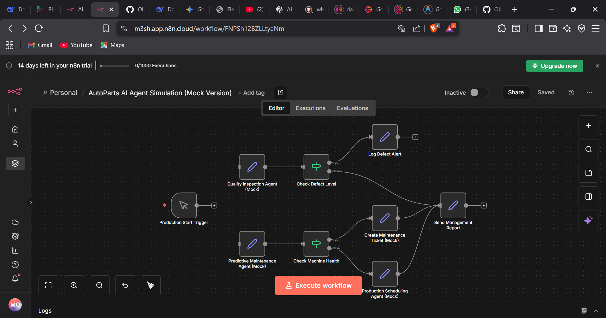

# AI_wk8 — AI Agents & Supply Chain Case Study (Week 8)

Welcome to AI_wk8 — a short project repository that documents a week-long study and practical simulation of AI agents for manufacturing and supply-chain problems. This repo contains a case study, conceptual notes, and a mocked n8n workflow (JSON) that simulates three collaborating agents: quality inspection, predictive maintenance, and production scheduling.

## What this repo contains ⚙️

- `case Study.md` — A detailed case study for "AutoParts Inc." describing the AI agent architecture, ROI analysis, risk assessment, and an implementation timeline for a smart manufacturing deployment.
- `autoparts.json` — A mocked n8n workflow (JSON) representing the simulated agents and their interactions (Quality Inspection, Predictive Maintenance, Production Scheduling, reporting nodes, etc.). You can import this file into an n8n instance or open it for reading to understand the example workflow.

- `section 1.md` — Notes and exploratory writing on AI agent topics (LangChain vs AutoGen, agent roles in supply chains, human-agent symbiosis, ethics, memory/state management and other agent design considerations).

## High-level purpose and learning goals 🎯

This repository is intended to:

- Demonstrate how a small suite of autonomous agents can be modeled to address manufacturing challenges (defect detection, unplanned downtime, and scheduling under constraints).
- Provide a readable case study that ties technical design to business outcomes (ROI, risk mitigation, and a practical rollout timeline).
- Offer conceptual notes that help compare frameworks and design patterns useful for building LLM-driven agents and multi-agent systems.

## How to explore and reuse the content 🔍

1. Read `case Study.md` to understand the scenario, agent responsibilities, and recommended implementation steps.
2. Open `autoparts.json` in a plain text editor or import into an n8n instance to visualize and run the mocked workflow. In n8n, use the import feature to import the JSON and then play the workflow in a demo environment.
3. Review `section 1.md` for conceptual background on modern agent frameworks and practical design considerations you might apply in your own projects.

## Usage ideas / How to extend

- Replace the mocked set nodes with real sensor inputs or webhooks to move from simulation to a real pilot.
- Attach real CV models or telemetry-based predictive maintenance models in place of the randomized values in `autoparts.json`.
- Integrate a human-in-the-loop step (HITL) for borderline defect detection, or add a database layer to log events and audit decisions.

## Contributing 🤝

Contributions are welcome! If you want to extend the case study, add real-world examples, or improve the simulation, please:

1. Fork the repo
2. Add your changes on a feature branch
3. Open a pull request describing your changes

If you’d like, add a README section describing how you validated the improvements and any environment or tool requirements.

## Notes & License

This repository is a learning/demo project. If you plan to reuse the content in a public or production setting, add an appropriate license and sanitize any confidential information.

---

